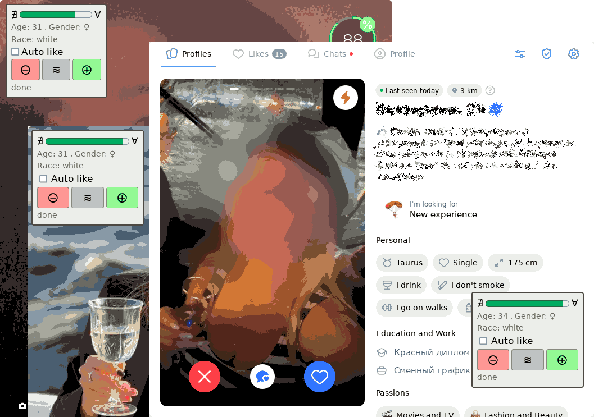

# Auto Like

Automatic like for dating sites.



## Run

To `auto-like` with basic settings use following command:

```bash
python3 main.py
```

## Installation

For CPU or NVidia platforms use following instructions to initialize virtual environment:

```bash
python3 -m venv venv # create virtual environment, if needed
source venv/bin/activate # activate virtual environment, if needed
python3 -m pip install -r requirements.txt
```

For AMD platform use following commands:

```bash
python3 -m venv venv # create virtual environment, if needed
source venv/bin/activate # activate virtual environment, if needed
python3 -m pip install --pre torch torchvision torchaudio --index-url 'https://download.pytorch.org/whl/nightly/rocm5.7/'
python3 -m pip install -r requirements.txt
```

## Inject Worker

To inject worker on any site use user script `utilities/console-injector.js`.
This script must work from both browser console and
[Greasemonkey](https://www.greasespot.net/). But for some sites Greasemonkey
can't execute script in `iframe` in this case use browser console.

## Database

To print database content use following command:

```sh
python utilities/print-database.py
```

## Other

Linter:

```sh
pylint main.py
```

Auto format code:

```sh
yapf -i main.py
```

## License

Source code is primarily distributed under the terms of the MIT license. See LICENSE for details.
